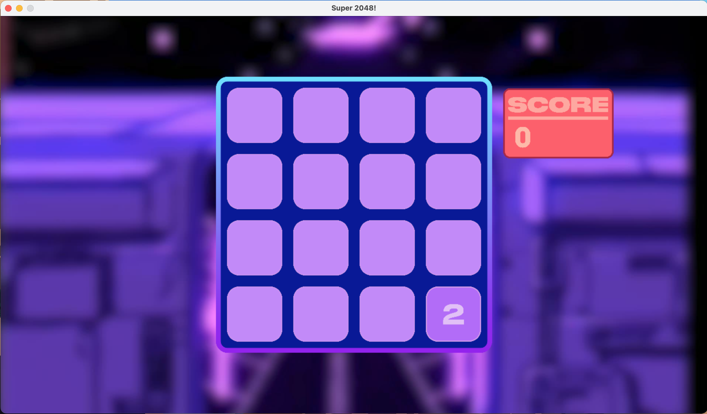
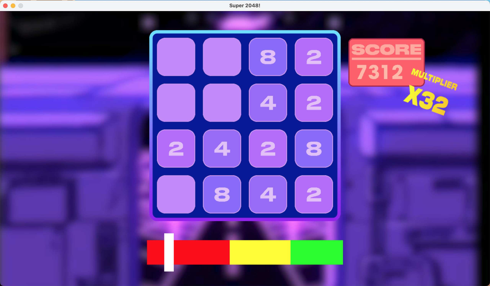
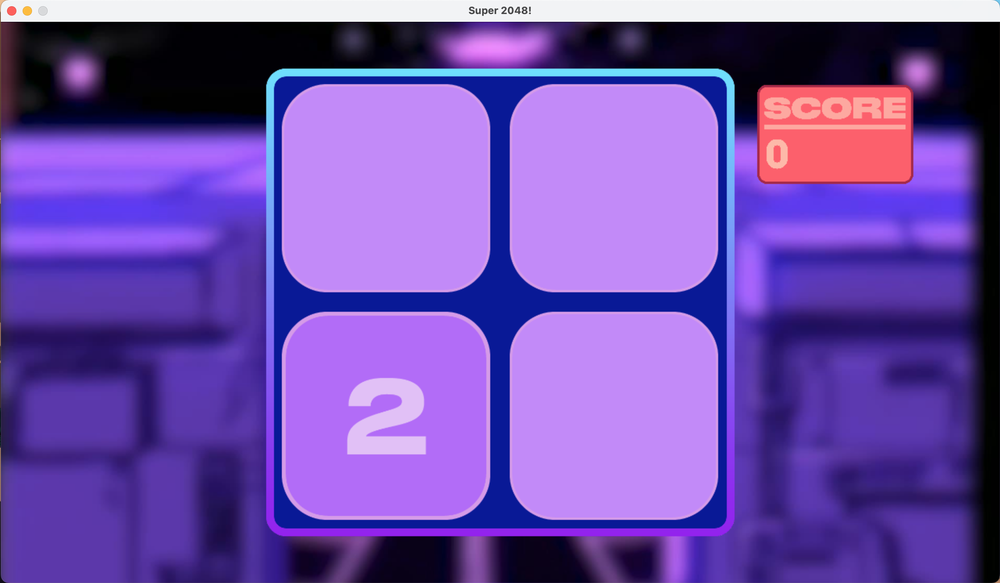

# Projet IN104 : 2048
*Par Clara Beaugrand et Joseph Mouscadet*

This project is a classical 2048 game for a CS class. 
It features a synthwave-inspired UI and several custom game modes :
- Classic mode, which is the traditional 2048

- Music mode : if you play while being synced with the beat, you earn (a lot) more points

- N-Dim mode : you can choose the dimension of the grid.

## REQUIREMENTS
Be careful, this game **requires** SDL2, SDL_image, SDL_ttf and SDL_mixer.
You have to build it yourself with CMake. 

Thanks for playing it!